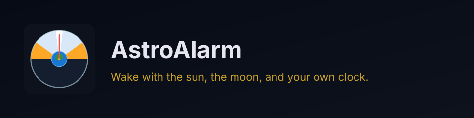
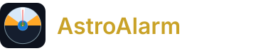
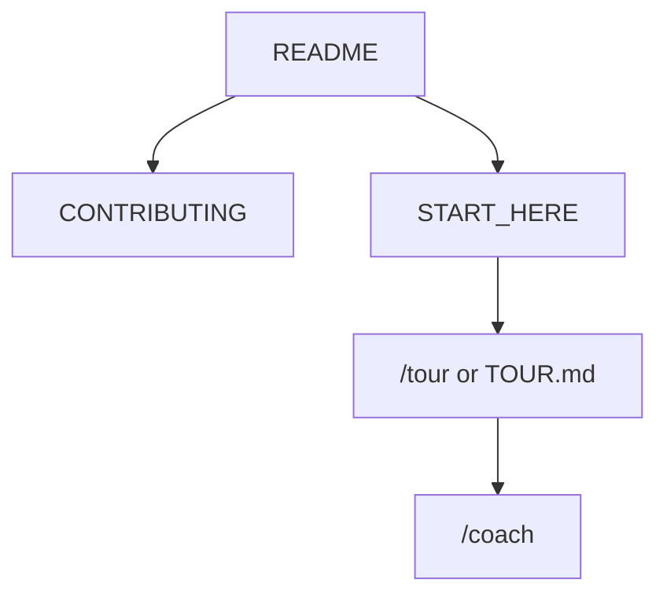

<!-- GENERATED by scripts/generate-project-readme.py — edit branding/product.json -->

  

<h1 align="center">AstroAlarm</h1>

<strong>Wake with the sun, the moon, and your own clock.</strong>

  
  
  
  
  
  
  
  
  
  
  

  

## Pitch

AstroAlarm is a FOSS Android astronomical alarm clock. It calculates sunrise, sunset, twilight, golden hour, moonrise, moon phases, solstices, and equinoxes on the device with NOAA and Meeus algorithms — no cloud, no Play Services, no trackers.

Set alarms for a solar or lunar event, offset them before or after, or pick a custom time on tactile hour and minute wheels. When the alarm rings it can speak the event, vibrate, and require a math puzzle before you can stop it.

A rotating day/night home widget shows the solar disk and the next alarm. Location comes from an offline city list or the system location provider. MIT licensed. GitHub Releases only.

## Demo

  

> Add screenshots or a short demo GIF under `docs/images/` and link them here when available.

## Features

- On-device NOAA solar and Meeus lunar ephemeris — no network required for calculations
- Eighteen solar events and eleven lunar events, plus custom clock alarms
- Lockscreen snooze and stop with an optional math unlock challenge
- Material You wheels for time and event offsets, with Spanish and French translations
- Rotating 24-hour day/night home widget with next-alarm preview
- 100% FOSS: no Google Play Services, Firebase, or proprietary telemetry

## Quick start

1. Install the APK from GitHub Releases (not listed on Play Store).
2. Set a city from the offline list or tap Locate so sun and moon events can fire.
3. Add a solar, lunar, or custom clock alarm. Choose tone, TTS, vibrate, math unlock, and snooze.
4. Optional: add the astronomical clock widget to the home screen.

## For humans

Start with this README, then [`CONTRIBUTING.md`](CONTRIBUTING.md) and [`docs/BEST_PRACTICES.md`](docs/BEST_PRACTICES.md). The first-month playbook is [`docs/FIRST_30_DAYS.md`](docs/FIRST_30_DAYS.md).

## For agents

Read [`docs/START_HERE.md`](docs/START_HERE.md) and [`AGENTS.md`](AGENTS.md). In Cursor type `/tour` or `/bootstrap`. Any other IDE: ask the agent to read [`docs/help/TOUR.md`](docs/help/TOUR.md). `/coach` is the next recommended action.

## Install

Users: install the APK from GitHub Releases. Developers: JDK 17 and Android SDK (compile/target 37, min 26). Clone the repo, open `examples/android/`, and run `./gradlew assembleDebug` (or `gradlew.bat` on Windows). No Play Services.

## Usage

Open AstroAlarm, set a location, then add alarms under Solar, Lunar, or Custom Clock. Exact alarms use AlarmManager.setAlarmClock and survive reboot. Contributors work from `BUILD_PLAN.md` and `docs/START_HERE.md`.

## Configuration

Copy [`.env.example`](.env.example) to `.env` for local secrets (never commit `.env`). Stack-specific config lives in the active `examples/` or app root after prune.

## Contributing

See [`CONTRIBUTING.md`](CONTRIBUTING.md). Prefer small PRs; follow Conventional Commits and the BUILD_PLAN labels (`AGENT` / `HUMAN` / `ADB` / `AUTO`). Status markers: 🔲 open · ✅ done · ❌ blocked.

## Security

See [`SECURITY.md`](SECURITY.md). Enable Dependabot alerts and follow [`docs/SECURITY_TRIAGE.md`](docs/SECURITY_TRIAGE.md) for weekly CVE triage.

## License

[MIT License](LICENSE) — see the license file for terms.

## Acknowledgments

Scaffolded with [agent-project-bootstrap](https://github.com/edwardlthompson/agent-project-bootstrap). Brand assets: [`branding/BRANDING.md`](branding/BRANDING.md). Design system: [`docs/DESIGN_GUIDE.md`](docs/DESIGN_GUIDE.md).
