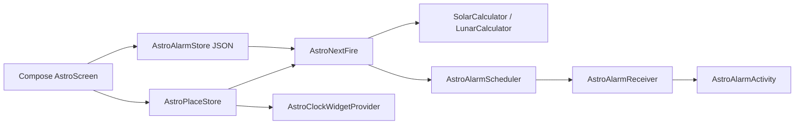

# Product Specification

> Spec-driven development stub. Fill after `init-project`. Feature slices still use `docs/features/{name}.md`.
> Status markers: 🔲 open · ✅ done · ❌ blocked.

## Overview

**Product:** AstroAlarm
**Purpose:** FOSS Android astronomical and solar/lunar clock alarm app with on-device suncalc sun/moon ephemeris (NOAA tropical longitude for seasons/zodiac), custom clock wheels, lockscreen snooze/stop with a math unlock challenge, and rotating day/night home widgets.
**Users:** People who want to wake or be reminded at sunrise, twilight, moon phases, or a chosen clock time without a cloud service.

## Functional Requirements & User Stories

| ID | Story | Acceptance |
|----|-------|------------|
| FR-1 | As a user I set a city so solar and lunar alarms can fire | Offline catalog or GPS/network location persists in `AstroPlaceStore` |
| FR-2 | As a user I add solar, lunar, or custom clock alarms | 18 solar events, 11 lunar events, custom hour/minute; JSON store + exact `AlarmManager` |
| FR-3 | As a user I stop a ringing alarm from the lockscreen | Snooze and Stop; math dialog when `mathUnlockEnabled` |
| FR-4 | As a user I see the next alarm on the home screen | Rotating day/night widget bitmap + countdown preview |
| FR-5 | As a user I can open an optional 24 Solar Terms year view | Settings toggle (default off); 2D wheel + 3D ring + widget; local times from `AstroPlace.zone` |
## Non-Functional Constraints

- MIT FOSS. No Google Play Services, Firebase, or proprietary telemetry
- Offline-first ephemeris (commons-suncalc sun/moon; NOAA apparent longitude for seasons and zodiac)
- File budgets: 300 lines static data/UI, 150 lines pure logic
- User-facing strings in `res/values/strings.xml` with `values-es` and `values-fr`

## Architecture & Data Flow

